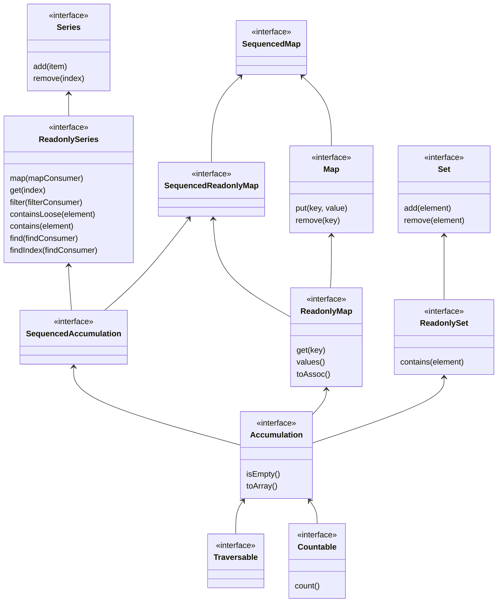

Development happens at AccumulatePHP-src

# AccumulatePHP
A PHP collections library, inspired by java collections framework.

## What is this library for
Every had to track down a bug just to find out that that one array_unique call turned your list array into an assoc array? AccumulatePHP solves those issues by distinguishing between Maps (assoc array) and Series (list array).  

## Static Analysis
AccumulatePHP provides first class support for static analysis through PHPStan level 9.

## Structure
### Accumulation
The Accumulation interface should be used to typehint against when only a basic collection (Accumulation) of items is needed. It keeps the door open for switching out implementations.

### Series
Interface for an accumulation with guaranteed order.

### MutableSeries
Interface for a series which can be modified.

### MutableArraySeries
A simple MutableSeries implementation using an array for storing values internally.

### Map
A key-value mapping.

### HashMap
A Hashtable-like map implementation.

