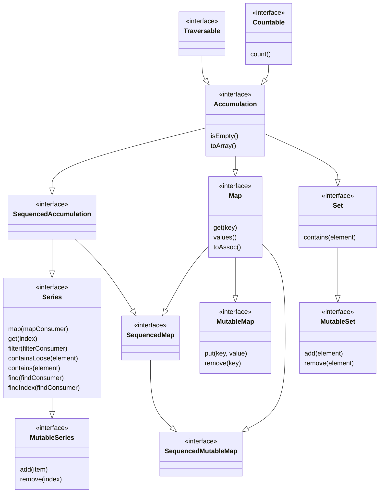

[](https://packagist.org/packages/nsilbernagel/accumulatephp)
[](https://packagist.org/packages/nsilbernagel/accumulatephp)
[](https://packagist.org/packages/nsilbernagel/accumulatephp)
[](https://packagist.org/packages/nsilbernagel/accumulatephp)

Development happens at [AccumulatePHP-src](https://github.com/N-Silbernagel/AccumulatePHP-src)

# AccumulatePHP
A PHP collections library, inspired by java collections framework.

## What is this library for
Using more refined datastructures allows for safer, often more efficient code than using arrays (list and assoc). TreeMap for example guarantees being searchable in O (log n). Furthermore, non-scalar keys can be used as keys in maps.

## Static Analysis
AccumulatePHP provides first class support for static analysis through PHPStan level 9.

## Installation
```bash
composer require nsilbernagel/accumulatephp
```

## Usage Examples
### ArraySeries
```php
// create empty list
$series = ArraySeries::new();

// create list with elements 1,2 and 3
$series = ArraySeries::of(1,2,3);

// add 4
$series->add(4);

// remove 4th element
$series->remove(3);

// filter list for event number
$evenNumbers = $series->filter(fn(int $number) => $number % 2 === 0)

// map list, multiplay all elements by 2
$multiplied = $series->map(fn(int $number) => $number*2)
```
For a complete overview of ArraySeries and the other series available, please refer to the source files under src/series

### HashMap
```php
// create empty map
$map = Hashmap::new();

// create map with initial entries
$map = Hashmap::of(
    Entry::of('example', 'code'),
    Entry::of('is', 'fun'),
);

// add entry
$map->put('isnt', 'it?');

// remove entry via key
$map->remove('isnt');
```
Hashmaps can use any type keys, except for resources and arrays. Classes may implement Hashable interface to determine their hash function and definition of equality. You may refer to https://www.baeldung.com/java-equals-hashcode-contracts to learn more about equals and hashcode and their contracts. 
## Structure



### Accumulation
The base interface of this library. An accumulation (collection) of items. Iterable and Countable.

### SequencedAccumulation
An Accumulation with a defined sequence or order of elements. Which order this is is up to the implementation. It might be insertion order for some or natural order for others.

### Series
A SequencedAccumulation that allows getting by index, mapping, filtering etc.

### MutableSeries
Like the Series but with methods for mutation.

### ArraySeries
Basic array implementation of a MutableSeries

### Map
A readonly key-value mapping. Can be created from and converted to associative arrays, will lose any non-scalar keys during conversion. Iterable over its entry objects. It is up to the implementation what type of keys are supported. It is strongly recommended to only use the same type of key for a map (can be enforced through static analysis tools).

### Entry
An entry of a map.

### SequencedMap
A Map with defined Order of keys

### MutableMap
Like Map but with methods for mutation.

### SequencedMap
A Map with defined Order of keys

### HashMap
A Hashtable-like map implementation.

### TreeMap
A Red-Black Tree SequencedMap implementation. Keys are ordered by their natural order (spaceship operator) by default.

### Set
An accumulation where every element may only exist once

### MutableSet
Like Set but with methods for mutation

### HashSet
Hash implementation of a Set. Uses HashMap in the background.

### StrictSet
A Set implementation using php strict comparison.
